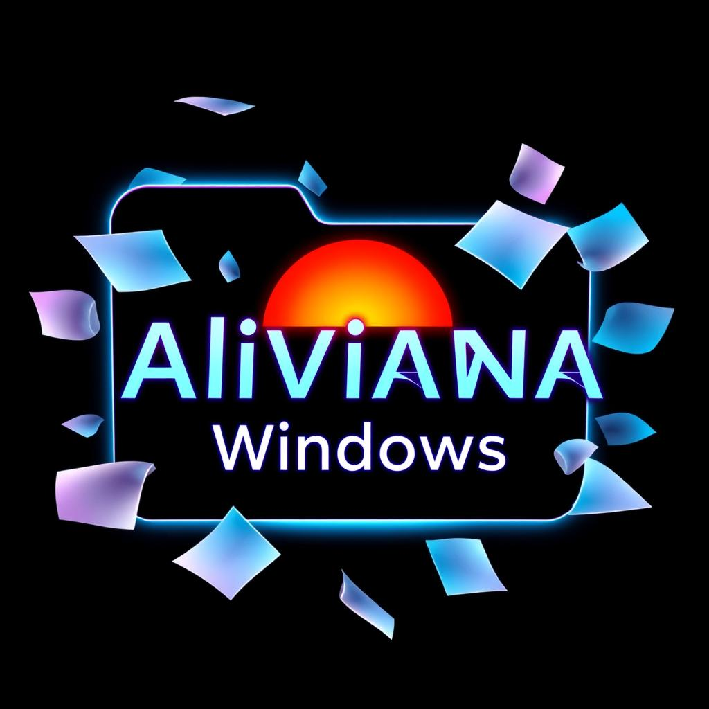
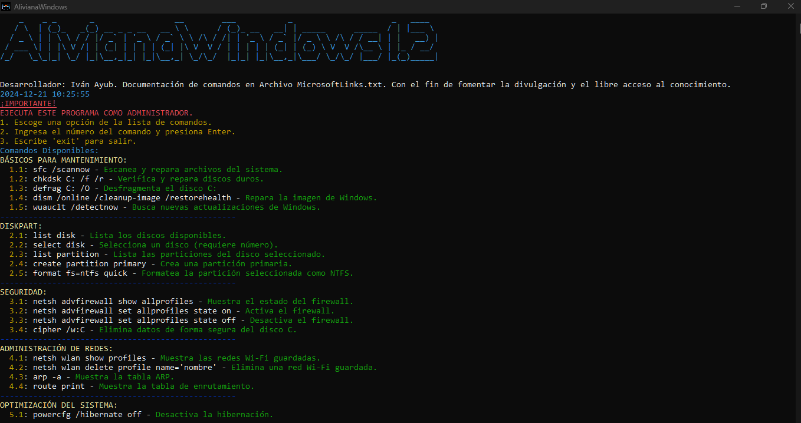
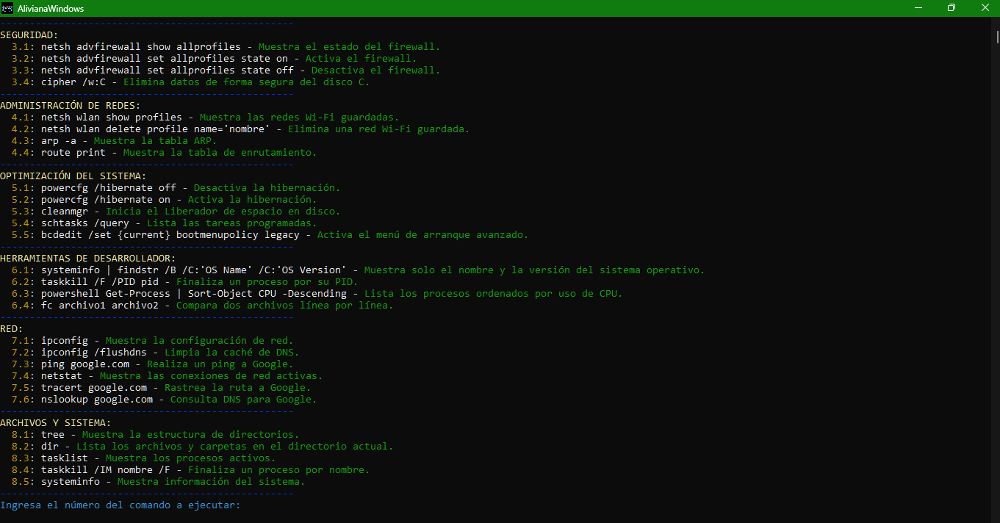

# AlivianaWindows

**Version: 1.2**

Developed by **Iván Ayub**

**AlivianaWindows** is an all-in-one tool designed to optimize the performance and health of Windows systems. It combines essential maintenance commands with a user-friendly console-based interface to simplify system care and management.

[Click here to download the application from Google Drive (.zip)](https://drive.google.com/file/d/1rH1N3V4qNefDXG0qIn2aAW1EDLhYPMH7/view?usp=drive_link)

For inquiries or feedback, contact me at: [Iván Ayub](sellocasadenubes@gmail.com).

---

## Description

**AlivianaWindows** provides a categorized list of essential commands to keep your Windows system in optimal condition. It is ideal for users seeking to improve system stability, resolve issues, and maintain performance with minimal effort.

---

## Features

### **System Maintenance:**

- Scans and repairs system files.
- Checks and repairs hard drives.
- Defragments disks to improve performance.

### **Network Administration:**

- Displays network configurations.
- Clears DNS cache.
- Verifies network connectivity with ping.

### **Process Management:**

- Displays running processes.
- Terminates unnecessary processes.

### **Boot Repair:**

- Repairs the Master Boot Record (MBR).
- Rebuilds the BCD (Boot Configuration Data).

### **Miscellaneous Tools:**

- Resets Microsoft Store.
- Enables or disables hibernation.

### **Interactive Interface:**

- Categorized commands for easy navigation.
- Clear prompts to execute tasks.

---

## Usage Instructions

1. **Run the program** as an administrator.
2. **Select a category** from the menu.
3. **Enter the command number** to execute.
4. **Follow the on-screen instructions** and check the results.
5. Type `exit` to close the program.

### Example Scenario

Want to ensure your system files are in top condition?
Open AlivianaWindows, select "System Maintenance," and run the "sfc /scannow" command to scan and repair corrupted files.

---

## Application Structure

### **User Interface (UI):**

The interface uses a text-based approach with colors and ASCII art for better readability, utilizing the **`pyfiglet`** and **`termcolor`** libraries.

### **Main Modules:**

1. **Command Execution:** Runs system maintenance commands using subprocess.
2. **Menu Navigation:** Organizes commands into intuitive categories.
3. **Error Handler:** Displays informative messages for successful or failed executions.

---

## System Requirements

- **Operating System:** Windows 10 or later
- **Dependencies:**
  - Python 3.10+
  - `pyfiglet`
  - `termcolor`

---

## Captures

---

## Development and Contribution

### **Credits:**

This software leverages the following libraries:

- **`pyfiglet`**: For ASCII art text.
- **`termcolor`**: For terminal text coloring.

Special thanks to Microsoft for providing official documentation on system commands.

### **Contributions:**

We welcome contributions! To contribute:

1. Fork the repository.
2. Make your changes.
3. Submit a pull request.

---

Enjoy using **AlivianaWindows**! Your feedback is invaluable and helps us continuously improve.

